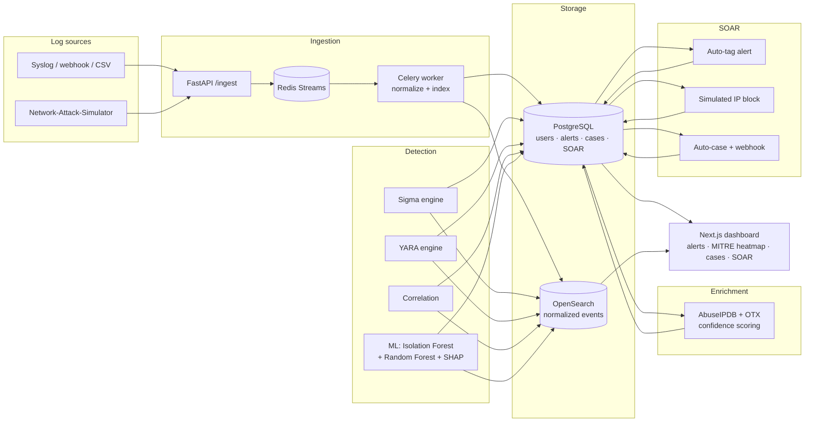

# Vantara — Architecture & Design Decisions

## System overview

Backend is FastAPI (Python 3.12), split into `api/routes` (HTTP surface), `detection/`, `ml/`, `threat_intel/`, and `soar/` (the four engines above), plus `workers/` for the Celery normalization pipeline. Frontend is Next.js 16 / React 19 / TypeScript, reading the same REST API. Everything runs locally via `docker-compose.yml` — Postgres for relational state, Redis for the ingestion stream and the Celery broker, OpenSearch for normalized event search.

## Why this scope, not the original spec

The original plan for this project sketched an enterprise-clone SIEM: Kafka ingestion, five parallel ML architectures, six-role RBAC with OAuth, a full STIX/TAXII/OpenCTI/MISP threat-intel stack, SOAR approval chains, and a dozen dashboards — roughly the surface area a 20–50 engineer team builds over a year at a company like Elastic or Splunk. Building to that spec solo would mean shallow coverage of everything and working code for almost none of it. Every cut below trades a resume *keyword* for something a solo build can actually finish, test, and explain in an interview.

| Area | Original spec | What Vantara actually builds | Why |
|---|---|---|---|
| Ingestion | Kafka + Kafka Connect | Redis Streams + Celery worker | Same ingest → queue → normalize → index shape, without Zookeeper/partitioning/consumer-group overhead a single-node project doesn't need. |
| Storage | OpenSearch + Postgres + Redis + object storage, hot/warm tiering | OpenSearch + Postgres + Redis | Tiering and object storage only matter at data volumes this project won't hit. |
| Detection | Sigma + YARA + correlation + a custom rule-builder UI + FP-reduction workflow | Sigma + YARA + MITRE ATT&CK mapping + basic correlation | The rule-builder UI and false-positive tuning workflow are v2; the detection logic itself is what's resume-relevant. |
| ML | Isolation Forest, Random Forest, XGBoost, Autoencoder, LSTM | Isolation Forest (unsupervised) + Random Forest (supervised) + SHAP | Two models with a real precision/recall/false-positive comparison says more than five listed with no comparative evaluation. |
| Threat intel | STIX/TAXII/OpenCTI/MISP/AbuseIPDB/OTX/VirusTotal | AbuseIPDB + AlienVault OTX (free tier) | STIX/TAXII/OpenCTI/MISP exist to federate intel *between platforms* — irrelevant with a single consumer. |
| Auth / RBAC | 6 roles, OAuth, API keys | JWT, 2 roles (Admin, Analyst) | Documented here as an extensible seam (`UserRole` enum + `api/deps.py` checks) rather than building and testing 6 permission matrices nobody exercises. |
| SOAR | Full playbook engine, approval workflows, real host isolation | 3 playbooks: auto-tag (MITRE + severity), simulated IP block, auto-case + webhook notify | Approval chains and real host isolation need infrastructure (EDR agents) this project doesn't have. |
| Case management | Full evidence chain, attachments, audit history | Create / assign / comment / status / close | Enough to demonstrate the workflow concept. |
| Frontend | Next.js/TS/Tailwind/shadcn/Recharts/React Flow | Kept as spec'd | High resume payoff for low operational cost — the one area not scoped down. |
| Monitoring | Prometheus + Grafana + Loki | Cut (stretch/v2) | Only worth adding if the core modules land with time to spare. |
| DevOps | Docker Compose, GitHub Actions, pre-commit, tests | Kept as spec'd | Cheap to add, expected at this resume tier regardless of scope elsewhere. |

## Build history

1. Repo scaffolding — Docker Compose skeleton, pre-commit, CI shell
2. Backend foundation — FastAPI, Postgres, Alembic, JWT auth (Admin/Analyst)
3. Ingestion & normalization — Redis Streams, Celery worker, OpenSearch indexing
4. Detection engine — Sigma rule execution, YARA scanning, MITRE ATT&CK mapping, correlation
5. Threat intel enrichment — AbuseIPDB + OTX IOC matching, confidence scoring
6. ML module — Isolation Forest + Random Forest, feature engineering, SHAP
7. Frontend — dashboards, alert view, MITRE heatmap
8. Case management + SOAR — case CRUD, the 3 automation playbooks
9. Testing, CI/CD hardening, documentation — 121 backend + 16 frontend tests, GitHub Actions covering lint/backend/frontend, pre-commit enforced locally, this doc

## Environment

Built and run inside an Ubuntu VM (Docker runs natively there). A separate Kali VM is reserved as the attack-traffic generator from Phase 3 onward (`Network-Attack-Simulator`, nmap, Hydra, Metasploit) — the same attacker/target-VM split used for HoneyShield — so the Sigma rules and MITRE mappings above are validated against real generated traffic, not just unit-test fixtures.
